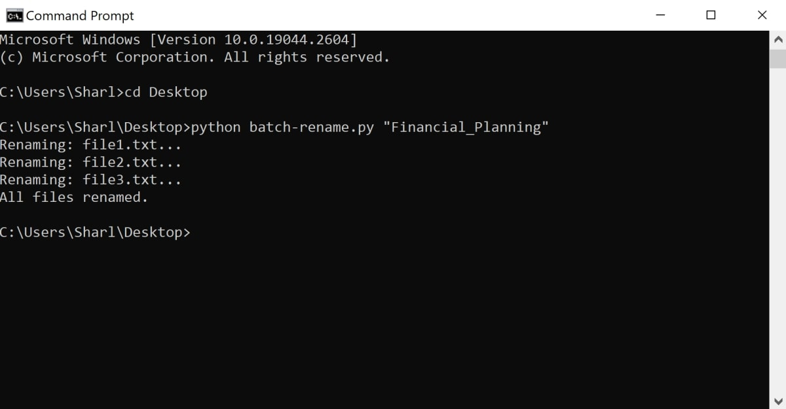

# python-batch-renaming-script
A script to batch rename multiple files based on a naming convention

## To Run

* Navigate to the python-batch-renaming-script folder in the command line or terminal.
* Run the script using the python command, followed by a pattern for renaming the files: python batch-rename.py "Financial_Planning"

## Example

